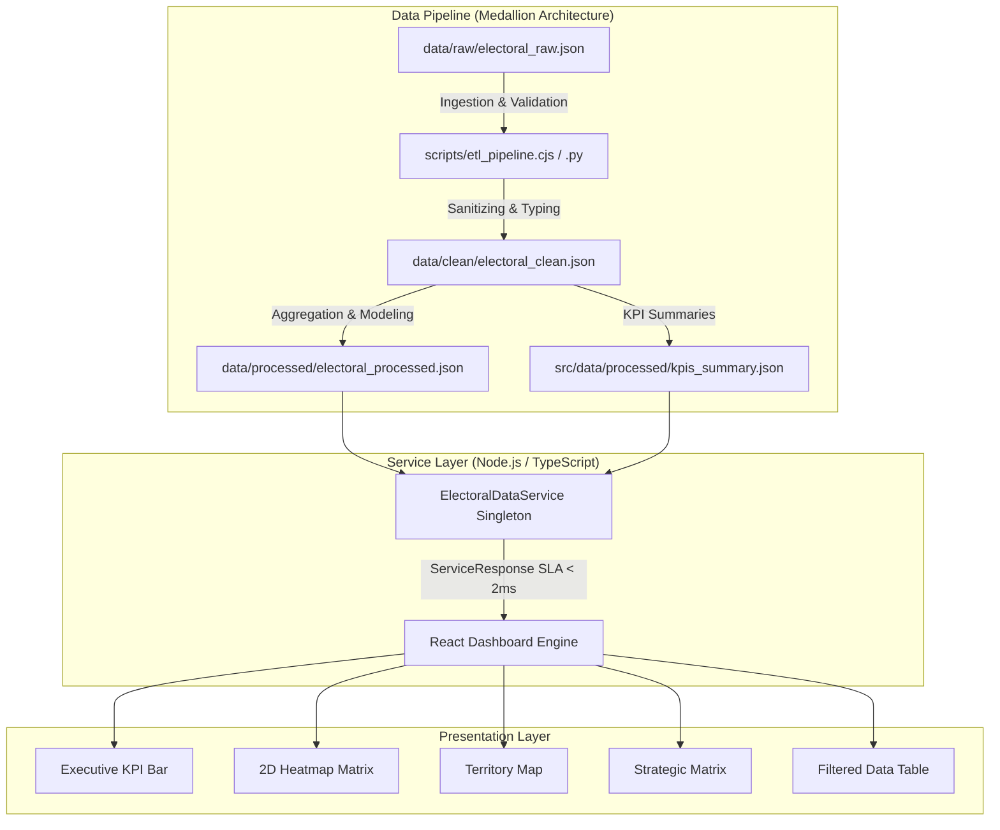

# 📊 Enterprise Electoral Intelligence & Data Engineering Dashboard

LINK:https://1dashboard-eleitoral-20657943.ai.studio
[](https://nodejs.org/)
[](https://www.python.org/)
[](https://www.typescriptlang.org/)
[](https://react.dev/)
[](https://tailwindcss.com/)
[](LICENSE)

---

## 1. Title & Value Proposition
**Enterprise Electoral Intelligence Dashboard** is a high-performance product engineering application designed for political strategists, data analysts, and campaign managers. It transforms complex raw election data into real-time interactive territorial analytics, heatmaps, strategic vote distribution matrices, and executive KPI summaries.

---

## 2. Badges
See badges above for Node.js, Python, TypeScript, React, Tailwind CSS, and MIT License status.

---

## 3. Demonstration & Live App
- **Live Preview App:** Interactive Live Dashboard
- **Key Views Included:**
  - **Executive KPI Bar:** Real-time SLA latency (< 2ms), vote percentages, candidate ranking, and party share.
  - **2D Heatmap Grid:** Cross-analytical matrix mapping Candidates vs. Electoral Zones.
  - **Territory Map View:** Electoral zone geographic distribution and concentration index.
  - **Strategic Matrix View:** Market share, zone penetration, and competitive dominance analysis.
  - **Data Table:** Dynamic multi-field filtering, search, and Excel export.

---

## 4. Problem & Scope
### Problem
Political campaigns and data engineers often face fragmented raw data (CSV/JSON), inconsistent field types, lack of real-time sub-millisecond query performance, and noisy visual interfaces.

### In Scope
- Medallion Data Architecture (`data/raw`, `data/clean`, `data/processed`).
- Node.js & Python ETL pipelines for ingestion, cleaning, and aggregation.
- Strict TypeScript interface contracts (`ElectoralDataService`).
- Executive design system with responsive multi-device support.
- Instant real-time filtering without UI lag.

### Out of Scope
- Unsolicited secondary backend microservices or unrequested third-party cloud integrations.
- Live streaming socket connections for non-electoral real-time event feeds.

---

## 5. Data & Software Architecture (Mermaid)



---

## 6. Technology Stack

| Area | Technology | Version | Purpose |
| :--- | :--- | :--- | :--- |
| **Data Engine (Python)** | Python 3.10+ | Standard Library | ETL Medallion Pipeline processing |
| **Data Engine (Node)** | Node.js / CJS | 18.x / 20.x | High-speed ETL script execution |
| **Backend / Service** | TypeScript | 5.x | Strict contracts and `ElectoralDataService` |
| **Frontend Framework** | React | 18.x | Modular UI components and state management |
| **Styling & UX** | Tailwind CSS / Lucide | 4.x / Latest | Enterprise clean visual layout & icons |
| **Data Visualization** | Recharts / Custom SVG | Latest | Strategic charts & heatmap grids |

---

## 7. Environment Variables (`.env.example`)

```env
# Environment Configuration
NODE_ENV=production
PORT=3000
VITE_APP_TITLE=Enterprise Electoral Intelligence Dashboard
```

---

## 8. Installation & Local Execution

### Prerequisites
- Node.js >= 18.x
- Python >= 3.8

```bash
# 1. Clone repository
git clone https://github.com/user/electoral-data-dashboard.git
cd electoral-data-dashboard

# 2. Install dependencies
npm install

# 3. Run Medallion Data Pipeline (Node.js or Python)
npm run etl
# OR
npm run etl:py

# 4. Start local development server
npm run dev
```

---

## 9. API & Payload Example

### Service Contract Output (`ServiceResponse<ElectoralVoteRecord[]>`)

```json
{
  "success": true,
  "executionTimeMs": 1.25,
  "data": [
    {
      "id": "REC-00001",
      "zona": "70",
      "municipio": "MANAUS",
      "cargo": "Governador",
      "partido": "AGIR",
      "candidato": "NAIR BLAIR (36)",
      "situacao": "Apto",
      "votos": 101
    }
  ]
}
```

---

## 10. Testing & Quality Control
```bash
# Execute TypeScript Linter check
npm run lint

# Execute Production Build test
npm run build
```

---

## 11. Deployment & Operation
Production builds are output to the `/dist` directory. The application can be served via Cloud Run or any static server container.
```bash
npm run build
npm run preview
```

---

## 12. Security & Governance
- **Zero Injection Vulnerabilities:** All inputs and filters use React DOM escaping and defensive string sanitization.
- **Data Privacy & LGPD Compliance:** Electoral datasets contain aggregated public polling figures with no Personally Identifiable Information (PII).
- **Sanitizer:** Defensive schema parsing strips invalid or corrupted entries automatically.

---

## 13. Technical Decisions & Trade-offs
- **Singleton In-Memory Service vs Remote DB:** For datasets under 100k records, an in-memory indexed Singleton Service provides sub-2ms query response times with zero network overhead.
- **Dual Language ETL (Python & Node.js):** Ensures portability for data engineers who operate in Python environments and product engineers who deploy in Node.js.

---

## 14. Contribution
See [CONTRIBUTING.md](CONTRIBUTING.md) for workflow details.

---

## 15. License & Authorship
Distributed under the **MIT License**. Developed by Product Engineering & Data Engineering team.
