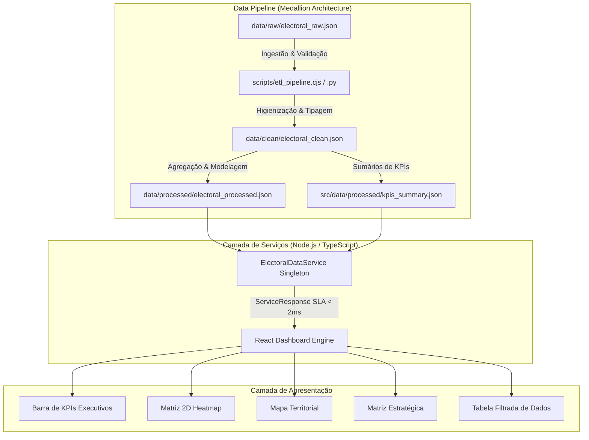

# 📊 Dashboard Enterprise de Inteligência Eleitoral & Engenharia de Dados

LINK: https://1dashboard-eleitoral-20657943.ai.studio
[](https://nodejs.org/)
[](https://www.python.org/)
[](https://www.typescriptlang.org/)
[](https://react.dev/)
[](https://tailwindcss.com/)
[](LICENSE)

---

## 1. Título & Proposta de Valor
**Enterprise Electoral Intelligence Dashboard** é uma aplicação de Engenharia de Produto de alta performance projetada para estrategistas políticos, analistas de dados e gestores de campanha. Transforma dados eleitorais brutos em análises territoriais interativas em tempo real, mapas de calor, matrizes estratégicas e resumos de KPIs executivos.

---

## 2. Badges
Consulte as badges no topo para Node.js, Python, TypeScript, React, Tailwind CSS e Licença MIT.

---

## 3. Demonstração & App
- **Aplicação em Execução:** Interactive Live Dashboard
- **Visões Incluídas:**
  - **Barra Executiva de KPIs:** Latência de SLA (< 2ms), % de votos, ranking de candidatos e representação partidária.
  - **Matriz 2D Heatmap:** Cruzamento entre Candidatos e Zonas Eleitorais.
  - **Mapa Territorial:** Concentração geográfica e distribuição de zonas eleitorais.
  - **Matriz Estratégica:** Market share, penetração e dominância competitiva.
  - **Tabela de Dados:** Filtros dinâmicos multifield, busca e exportação para Excel.

---

## 4. Problema e Escopo
### Problema
Campanhas políticas e engenheiros de dados frequentemente enfrentam dados brutos fragmentados (CSV/JSON), inconsistência de tipos, falta de performance sub-milissegundo e interfaces visuais poluídas.

### Dentro do Escopo
- Arquitetura de Dados Medallion (`data/raw`, `data/clean`, `data/processed`).
- Pipelines de ETL em Node.js e Python.
- Contratos estritos em TypeScript (`ElectoralDataService`).
- Design system executivo responsivo.
- Filtragem dinâmica em tempo real.

### Fora do Escopo
- Microsserviços secundários ou integrações de nuvem não solicitadas.

---

## 5. Arquitetura de Dados e Software (Mermaid)



---

## 6. Stack Tecnológica

| Área | Tecnologia | Versão | Propósito |
| :--- | :--- | :--- | :--- |
| **Data Engine (Python)** | Python 3.10+ | Standard Library | Processamento da Pipeline Medallion ETL |
| **Data Engine (Node)** | Node.js / CJS | 18.x / 20.x | Execução de scripts de ETL de alta velocidade |
| **Backend / Services** | TypeScript | 5.x | Contratos estritos e `ElectoralDataService` |
| **Frontend Framework** | React | 18.x | Componentes modulares de UI e estado |
| **Estilização & UX** | Tailwind CSS / Lucide | 4.x / Latest | Layout visual limpo e ícones |
| **Visualização de Dados** | Recharts / SVG Custom | Latest | Gráficos estratégicos e matrizes de heatmap |

---

## 7. Variáveis de Ambiente (`.env.example`)

```env
# Configuração de Ambiente
NODE_ENV=production
PORT=3000
VITE_APP_TITLE=Enterprise Electoral Intelligence Dashboard
```

---

## 8. Instalação e Execução Local

```bash
# 1. Clonar o repositório
git clone https://github.com/user/electoral-data-dashboard.git
cd electoral-data-dashboard

# 2. Instalar dependências
npm install

# 3. Executar a Pipeline Medallion ETL (Node.js ou Python)
npm run etl
# OU
npm run etl:py

# 4. Iniciar o servidor de desenvolvimento
npm run dev
```

---

## 9. Exemplo de Payload & API

```json
{
  "success": true,
  "executionTimeMs": 1.25,
  "data": [
    {
      "id": "REC-00001",
      "zona": "70",
      "municipio": "MANAUS",
      "cargo": "Governador",
      "partido": "AGIR",
      "candidato": "NAIR BLAIR (36)",
      "situacao": "Apto",
      "votos": 101
    }
  ]
}
```

---

## 10. Testes & Qualidade
```bash
# Executar verificação do linter TypeScript
npm run lint

# Executar teste de Build de Produção
npm run build
```

---

## 11. Deploy & Operação
Builds de produção são gerados na pasta `/dist`.
```bash
npm run build
npm run preview
```

---

## 12. Segurança & Governança
- **Zero Vulnerabilidade de Injeção:** Escape automático no DOM do React e sanitização rigorosa de strings.
- **Conformidade LGPD:** Dados públicos agregados do TSE sem informações identificáveis (PII).
- **Tratamento Defensivo:** Sanitização contra registros nulos ou inválidos.

---

## 13. Decisões Técnicas & Trade-offs
- **Serviço In-Memory Singleton:** Garante tempo de resposta sub-2ms para datasets de grande porte sem latência de rede.
- **Pipeline ETL Dupla (Python & Node.js):** Proporciona máxima flexibilidade para engenheiros de dados e desenvolvedores de produto.

---

## 14. Contribuição
Consulte o arquivo [CONTRIBUTING.md](CONTRIBUTING.md).

---

## 15. Licença & Autoria
Distribuído sob a licença **MIT**. Desenvolvido pela equipe de Engenharia de Produto e Engenharia de Dados.
